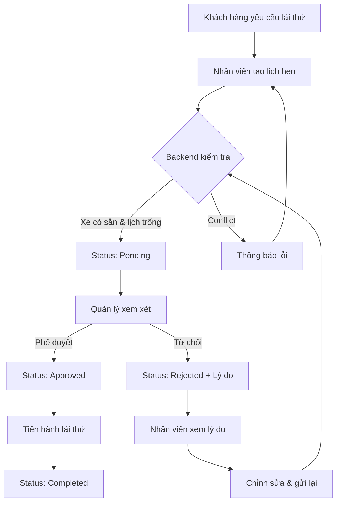

# 🚗 Hướng dẫn sử dụng Quản lý Lịch hẹn lái thử (Với Workflow Phê duyệt)

## 📋 Tổng quan

Chức năng **Quản lý Lịch hẹn lái thử** cho phép đại lý quản lý các buổi hẹn lái thử xe của khách hàng với quy trình phê duyệt chính thức giữa **Nhân viên (DealerStaff)** và **Quản lý (DealerAdmin/DealerManager)**.

---

## 🔄 Workflow Phê duyệt

### **Quy trình hoạt động:**



### **6 Trạng thái lịch hẹn:**

| Trạng thái | Mô tả | Màu | Ai có thể thực hiện |
|------------|-------|-----|---------------------|
| **Pending** | Chờ phê duyệt | Vàng | Nhân viên tạo |
| **Approved** | Đã phê duyệt | Xanh | Quản lý duyệt |
| **Rejected** | Đã từ chối | Đỏ | Quản lý từ chối |
| **ChangeRequested** | Yêu cầu thay đổi | Cam | Backend/Manager |
| **Completed** | Đã hoàn thành | Xanh dương | Sau khi lái thử |
| **Cancelled** | Đã hủy | Xám | Staff/Manager |

---

## ✨ Tính năng theo Vai trò

### 👤 **Nhân viên Đại lý (DealerStaff)**

#### ✅ Có thể làm:
- ✅ **Tạo lịch hẹn mới** (tự động status = Pending)
- ✅ **Xem tất cả lịch hẹn** của đại lý
- ✅ **Chỉnh sửa** lịch hẹn đang Pending hoặc Rejected
- ✅ **Xóa** lịch hẹn đang Pending
- ✅ **Xem lý do từ chối** khi status = Rejected

#### ❌ Không thể:
- ❌ Phê duyệt lịch hẹn
- ❌ Từ chối lịch hẹn
- ❌ Sửa/xóa lịch hẹn đã Approved
- ❌ Xem lịch hẹn của đại lý khác

### 👨‍💼 **Quản lý Đại lý (DealerAdmin/DealerManager)**

#### ✅ Có thể làm:
- ✅ **Phê duyệt** lịch hẹn Pending
- ✅ **Từ chối** lịch hẹn Pending (phải nhập lý do)
- ✅ **Xem tất cả lịch hẹn**
- ✅ **Sửa/xóa** bất kỳ lịch hẹn nào
- ✅ **Tạo lịch hẹn** trực tiếp (nếu cần)

#### 🎯 Trách nhiệm:
- Xem xét lịch hẹn Pending
- Đảm bảo xe có sẵn và lịch không trùng
- Nhập lý do rõ ràng khi từ chối

---

## 🎯 Hướng dẫn sử dụng

### 📍 Truy cập trang

1. Đăng nhập với role **DealerStaff** hoặc **DealerAdmin**
2. Click **"Test Drive"** trong menu sidebar
3. Hoặc truy cập: `http://localhost:5173/test-drive`

---

### 🆕 Tạo lịch hẹn mới (Nhân viên)

**Bước 1:** Click nút **"Tạo lịch hẹn mới"**

**Bước 2:** Điền thông tin:

| Trường | Yêu cầu | Ghi chú |
|--------|---------|---------|
| **Tên khách hàng** | Bắt buộc | Tên đầy đủ |
| **Số điện thoại** | Bắt buộc | 10-11 chữ số |
| **Ngày & Giờ** | Bắt buộc | Phải là tương lai |
| **Xe** | Bắt buộc | Chọn từ danh sách |
| **Đại lý** | Bắt buộc | Thường auto-select |
| **Ghi chú** | Tùy chọn | Yêu cầu đặc biệt |

**Bước 3:** Click **"Tạo lịch hẹn"**

**Kết quả:**
- ✅ Thành công → Status = **Pending**, chờ manager duyệt
- ❌ Lỗi → Backend báo conflict (xe không có sẵn, lịch trùng...)

---

### ✔️ Phê duyệt lịch hẹn (Quản lý)

**Bước 1:** Tìm lịch hẹn có status **"Chờ phê duyệt"** (badge vàng)

**Bước 2:** Click nút **"✓ Phê duyệt"** trong cột "Thao tác"

**Bước 3:** Xác nhận trong hộp thoại

**Kết quả:**
- ✅ Status chuyển sang **Approved** (badge xanh)
- ✅ Tên manager được ghi nhận
- ✅ Thông báo success hiển thị
- ✅ Nhân viên có thể tiến hành lái thử

---

### ❌ Từ chối lịch hẹn (Quản lý)

**Bước 1:** Tìm lịch hẹn **Pending**

**Bước 2:** Click nút **"✕ Từ chối"** 

**Bước 3:** Nhập **lý do từ chối** trong modal:

**Ví dụ lý do phổ biến:**
- "Xe không có sẵn vào thời gian này. Vui lòng chọn thời gian khác."
- "Lịch đã trùng với khách hàng khác. Vui lòng chọn giờ khác."
- "Xe đang bảo trì. Vui lòng chọn xe khác hoặc đợi 3 ngày."

**Bước 4:** Click **"Xác nhận từ chối"**

**Kết quả:**
- ❌ Status chuyển sang **Rejected** (badge đỏ)
- ❌ Lý do từ chối hiển thị ngay dưới status
- 📧 Nhân viên có thể xem lý do và chỉnh sửa

---

### 📝 Chỉnh sửa lịch hẹn bị từ chối (Nhân viên)

**Khi nào:**
- Lịch hẹn có status = **Rejected**
- Nhân viên muốn sửa và gửi lại

**Cách làm:**

**Bước 1:** Tìm lịch hẹn bị từ chối (badge đỏ)

**Bước 2:** Đọc **lý do từ chối** (text màu đỏ dưới status)

**Bước 3:** Click icon **✏️ (Edit)**

**Bước 4:** Chỉnh sửa theo lý do:
- Đổi thời gian nếu trùng lịch
- Đổi xe nếu xe không có sẵn
- Cập nhật thông tin khác

**Bước 5:** Click **"Cập nhật"**

**Kết quả:**
- ✅ Status quay lại **Pending**
- ✅ Lịch hẹn được gửi lại cho manager xem xét

---

### 🗑️ Xóa lịch hẹn

**Ai có thể xóa:**
- **Nhân viên:** Chỉ lịch hẹn **Pending**
- **Quản lý:** Mọi lịch hẹn

**Cách xóa:**

1. Click icon **🗑️ (Delete)** trong cột "Thao tác"
2. Xác nhận trong hộp thoại
3. Lịch hẹn bị xóa vĩnh viễn

---

### 🔍 Lọc và tìm kiếm

**Bộ lọc có sẵn:**

#### 1. **Lọc theo Trạng thái**
```
- Tất cả
- Chờ phê duyệt (Pending)
- Đã phê duyệt (Approved)
- Đã từ chối (Rejected)
- Đã hoàn thành (Completed)
- Đã hủy (Cancelled)
```

#### 2. **Lọc theo Đại lý**
- Dropdown hiển thị tất cả đại lý active

#### 3. **Lọc theo Xe**
- Dropdown hiển thị tất cả xe có sẵn

**Cách dùng:**
1. Chọn giá trị từ các dropdown
2. Kết quả tự động cập nhật
3. Click **"Xóa bộ lọc"** để reset

---

## 🎨 Giao diện

### 📊 **Bảng danh sách**

| Cột | Thông tin hiển thị |
|-----|-------------------|
| **Khách hàng** | Tên + ghi chú (nếu có) |
| **Số điện thoại** | Số liên lạc |
| **Xe** | Hãng, model, năm, màu |
| **Đại lý** | Tên và địa điểm |
| **Ngày & Giờ** | dd/MM/yyyy HH:mm |
| **Trạng thái** | Badge màu + lý do từ chối (nếu có) |
| **Người tạo** | Tên nhân viên + tên manager (nếu đã duyệt) |
| **Thao tác** | Buttons theo role |

### 🎨 **Status Badges**

```css
🟡 Chờ phê duyệt  - Badge vàng
🟢 Đã phê duyệt   - Badge xanh lá
🔴 Đã từ chối     - Badge đỏ (+ lý do)
🟠 Yêu cầu thay đổi - Badge cam
🔵 Đã hoàn thành  - Badge xanh dương
⚫ Đã hủy        - Badge xám
```

### 🔘 **Action Buttons theo Role**

#### **Nhân viên thấy:**
- 👁️ Xem
- ✏️ Sửa (chỉ Pending/Rejected)
- 🗑️ Xóa (chỉ Pending)

#### **Quản lý thấy:**
- ✓ Phê duyệt (chỉ Pending)
- ✕ Từ chối (chỉ Pending)
- 👁️ Xem
- ✏️ Sửa (tất cả)
- 🗑️ Xóa (tất cả)

---

## 🔧 Backend Integration

### **API Endpoints cần implement:**

#### **CRUD cơ bản:**
```http
GET    /api/TestDrive                    # Lấy danh sách (có filters)
GET    /api/TestDrive/{id}               # Chi tiết
POST   /api/TestDrive                    # Tạo mới (auto status=Pending)
PUT    /api/TestDrive/{id}               # Cập nhật
DELETE /api/TestDrive/{id}               # Xóa
```

#### **Approval Workflow:**
```http
POST   /api/TestDrive/{id}/approve       # Phê duyệt
POST   /api/TestDrive/{id}/reject        # Từ chối (với rejectionReason)
POST   /api/TestDrive/{id}/request-change # Yêu cầu thay đổi
```

#### **Supporting APIs:**
```http
GET    /api/Vehicles                     # Danh sách xe
GET    /api/Dealers                      # Danh sách đại lý
```

### **Backend Request/Response:**

#### **Create Request:**
```json
{
  "testDate": "2025-10-25T09:00:00Z",
  "customerName": "Nguyễn Văn A",
  "customerContact": "0912345678",
  "notes": "Khách muốn lái thử buổi sáng",
  "dealerId": "dealer-uuid",
  "vehicleId": "vehicle-uuid"
}
```

#### **Approve Request:**
```json
{
  "testDriveId": "td-uuid",
  "approvedBy": "manager-uuid"
}
```

#### **Reject Request:**
```json
{
  "testDriveId": "td-uuid",
  "rejectedBy": "manager-uuid",
  "rejectionReason": "Xe không có sẵn vào thời gian này"
}
```

#### **Response Format:**
```json
{
  "success": true,
  "message": "Operation successful",
  "data": {
    "id": "td-uuid",
    "status": "Approved",
    "customerName": "Nguyễn Văn A",
    ...
  }
}
```

### **Backend phải xử lý:**
✅ **Vehicle availability check** - Xe có sẵn không?
✅ **Schedule conflict detection** - Lịch có trùng không?
✅ **Authorization** - User có quyền không?
✅ **Status validation** - Transition hợp lệ không?
✅ **Data validation** - Input đúng format không?

### **Frontend chỉ:**
- 📱 Hiển thị UI
- 📤 Gọi API
- 📥 Nhận và hiển thị error từ backend
- 🎨 Update UI theo response

---

## 📊 Mock Data

### **4 Test Drives mẫu:**

#### 1. **Pending - Chờ duyệt**
```
Khách: Nguyễn Văn A
Xe: VF e34 (Đỏ)
Thời gian: 2 ngày sau
Status: Pending (Vàng)
Người tạo: Nhân viên Nguyễn Thị C
```

#### 2. **Approved - Đã duyệt**
```
Khách: Trần Thị B
Xe: VF 8 (Xanh)
Thời gian: 5 ngày sau
Status: Approved (Xanh)
Người tạo: Nhân viên Trần Văn D
Người duyệt: Quản lý Lê Thị E
```

#### 3. **Completed - Đã hoàn thành**
```
Khách: Lê Văn C
Xe: VF 9 (Trắng)
Thời gian: 1 ngày trước
Status: Completed (Xanh dương)
```

#### 4. **Rejected - Đã từ chối**
```
Khách: Phạm Văn D
Xe: VF e34 (Đỏ)
Status: Rejected (Đỏ)
Lý do: "Xe không có sẵn vào thời gian này. Vui lòng chọn thời gian khác."
```

---

## ⚙️ Configuration

### **Mock Data Mode (Hiện tại):**

```typescript
// File: src/services/testDriveService.ts
private useMockData = true; // Đang bật
```

**Đặc điểm:**
- ✅ Chạy độc lập, không cần backend
- ✅ Có 4 test drives mẫu với đủ 4 status
- ✅ Approve/reject hoạt động ngay lập tức
- ✅ Dữ liệu lưu trong memory

### **Kết nối Backend:**

**Bước 1:** Đảm bảo backend chạy tại `http://localhost:5000`

**Bước 2:** Mở `src/services/testDriveService.ts`

**Bước 3:** Đổi dòng 188:
```typescript
private useMockData = false; // Tắt mock
```

**Bước 4:** Backend phải implement đầy đủ endpoints ở trên

---

## 🐛 Troubleshooting

### **1. Không thấy nút "Phê duyệt/Từ chối"**

**Nguyên nhân:** User không phải DealerAdmin

**Giải pháp:**
- Login với role **DealerAdmin**
- Dev account: `username: dev, password: dev123` (có CompanyAdmin role)
- Hoặc tạo account với DealerAdmin role

### **2. Không sửa được lịch hẹn**

**Nguyên nhân:** Status không phải Pending/Rejected

**Giải pháp:**
- Nhân viên chỉ sửa được Pending hoặc Rejected
- Manager có thể sửa tất cả status

### **3. Lỗi khi phê duyệt/từ chối**

**Kiểm tra:**
- User đã login chưa?
- User có role DealerAdmin không?
- Status có phải Pending không?
- Backend có chạy không? (nếu tắt mock mode)

### **4. Lý do từ chối không hiển thị**

**Nguyên nhân:** Status không phải Rejected hoặc rejectionReason rỗng

**Giải pháp:**
- Đảm bảo nhập lý do khi từ chối
- Kiểm tra response từ backend có rejectionReason không

---

## 📈 Best Practices

### **Cho Nhân viên:**
1. ✅ Nhập đầy đủ thông tin khách hàng
2. ✅ Kiểm tra kỹ thời gian trước khi tạo
3. ✅ Đọc kỹ lý do từ chối để sửa đúng
4. ✅ Ghi chú rõ ràng yêu cầu đặc biệt
5. ❌ Không tạo lịch hẹn trùng giờ

### **Cho Quản lý:**
1. ✅ Xem xét kỹ trước khi phê duyệt
2. ✅ Nhập lý do rõ ràng, cụ thể khi từ chối
3. ✅ Đề xuất giải pháp trong lý do từ chối
4. ✅ Phản hồi nhanh để không delay khách hàng
5. ❌ Không phê duyệt nếu không chắc chắn

---

## 🚀 Tính năng mở rộng (Roadmap)

### **Phase 2:**
- 📧 Email notification cho customer
- 📱 SMS reminder trước 1 ngày
- 📅 Calendar view (Google Calendar sync)
- 📊 Dashboard thống kê

### **Phase 3:**
- ⭐ Rating & feedback sau lái thử
- 📄 Export PDF/Excel
- 🔔 Real-time notification (WebSocket)
- 📈 Analytics & Reports

---

## 💡 Tips & Tricks

### **Phím tắt:**
- `Ctrl + F` - Tìm kiếm nhanh trong bảng
- `Esc` - Đóng modal
- `Tab` - Di chuyển giữa các trường trong form

### **Lọc nhanh:**
- Filter "Chờ phê duyệt" để xem công việc cần làm
- Filter "Đã từ chối" để xem lịch cần sửa
- Filter theo dealer để xem riêng từng đại lý

---

## 📞 Support

**Nếu gặp vấn đề:**
1. Kiểm tra console log (F12 → Console)
2. Kiểm tra role của user hiện tại
3. Kiểm tra backend có chạy không
4. Đọc lại hướng dẫn này
5. Liên hệ team dev

---

## ✅ Checklist Hoàn thành

### **Frontend:**
- [x] TypeScript types với status enum
- [x] API service với approve/reject methods
- [x] ApprovalActions component
- [x] TestDriveList với role-based permissions
- [x] TestDriveForm với validation
- [x] TestDriveManagement page
- [x] Status badges với 6 states
- [x] Rejection reason display
- [x] Role-based UI (Staff vs Manager)
- [x] Filters by status
- [x] Mock data với 4 samples
- [x] Responsive design
- [x] Dark mode support

### **Backend cần implement:**
- [ ] TestDrive CRUD APIs
- [ ] Approve endpoint
- [ ] Reject endpoint
- [ ] Vehicle availability check
- [ ] Schedule conflict detection
- [ ] Authorization middleware
- [ ] Status validation
- [ ] Vehicle & Dealer APIs

---

**Phiên bản:** 2.0.0 (With Approval Workflow)  
**Ngày cập nhật:** October 20, 2025  
**Trạng thái:** ✅ Frontend Complete | ⏳ Chờ Backend

---

## 🎉 Kết luận

Hệ thống **Lịch hẹn lái thử** hiện đã có đầy đủ workflow phê duyệt, phân quyền role-based, và UI/UX hoàn chỉnh. 

Frontend đã sẵn sàng, chỉ cần backend implement các endpoints và business logic để hệ thống hoạt động hoàn toàn!

**Happy Coding!** 🚀
